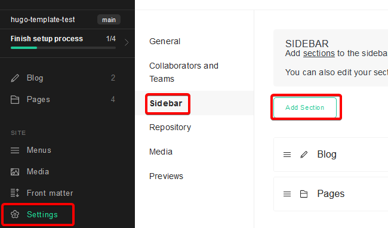

# Building a Hugo Theme from scratch

## Getting Started

- Assume base Hugo installation
- `git new site mySite` then `git init`
- add "public/" to gitignore
- Clone theme then delete `.git` folder (Want to own these files now, since they might change from under you) (or use gitmodule? haven't tried that yet)
  - `git clone https://github.com/vimux/blank`

## Start Theming

- Prep HTML template (possibly add to repo so you have original source)
- Copy static assets over to `static` folder.
- Add place holder content files for various pages:
  - Add home page - `hugo new _index.md`
  - Add other index pages - `hugo new blog/_index.md`
  - Add normal pages -  `hugo new about.md`

### Initial Layout

Edit `baseof.html` to match structure from `index.html` or `about.html`.  Everything around `body` tags.

It might be better to user a *normal* page for this initial layout. Tip: do a `diff` between `index.html` and `page.html` to look for structural differences. This may guide how you structure the initial template.

Look for structures that match the Hugo partials: *header, footer, main*. Take note of how *main* differs in the different page templates.

Style site title accordingly `Page Title - Site Name` if not at home.

Use lessons to build `single.html`

- Pull elements from certain partials into config.yaml `params` so they can be edited.
  - e.g.: Phone numbers, email address, social links, logo images
  - How much depends on if this is a theme for reuse or not.

### Styling Menu

- Add menu items to config file. Make sure to add `weight` field.
- Style menu in navigation [section](https://gohugo.io/templates/menu-templates/)
  - Note: Had some difficulty getting `IsMenuCurrent` to work as advertised
    - Setting menu in front matter fixed this.

### Style Pages

- Home Page
  - Create Home Page Template `layouts/index.html`
  - Dump HTML from home page
  - Examine replaceable bits and pull out into front matter on the page.
- Special pages (About, Contact, etc.)
  - Create page template: `layout/_default/my-page.html`
  - Set `layout` in front matter of page
  - As an alternative:
    - create page under a section e.g. `content/about/_index.md` and create template as `layout/about/list.html`
  - Dump page HTML in template
  - Extract bits into front matter.

## Forestry Setup

- Push to github, them import to Forestry
- 
- Configure the sidebar to add the `config.yaml`, if it doesn't already exist:
  - 
  - Add document for `config.yaml` 

## Resources

- [Blank Starter Theme](https://themes.gohugo.io/themes/blank/)
- [TOML to YAML converter](https://www.convertsimple.com/convert-toml-to-yaml)
- Markdown Editing - Typora
